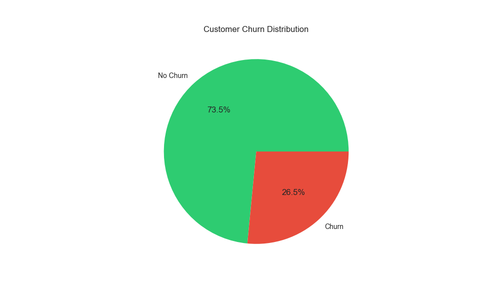
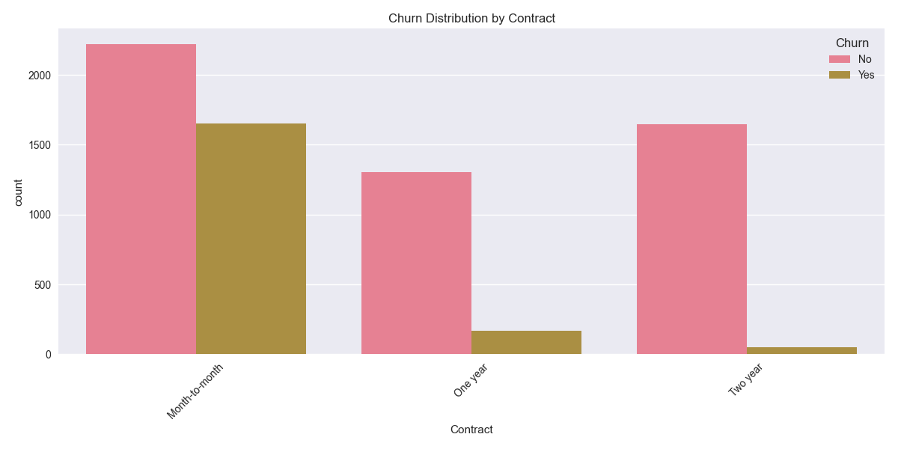
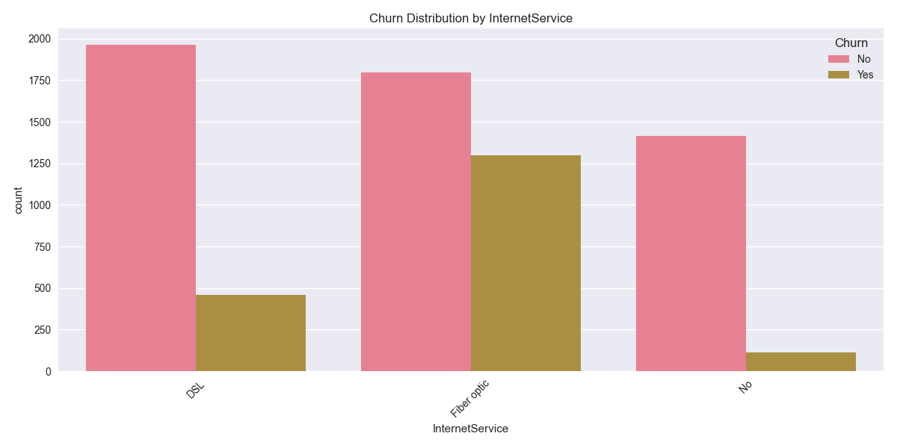
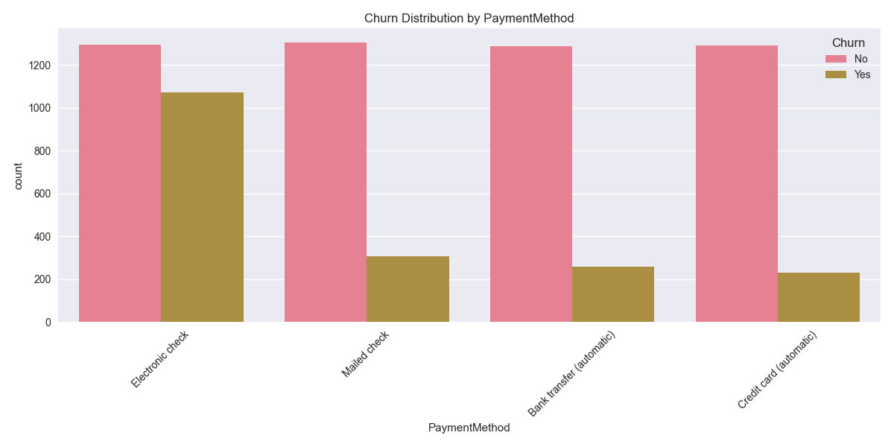
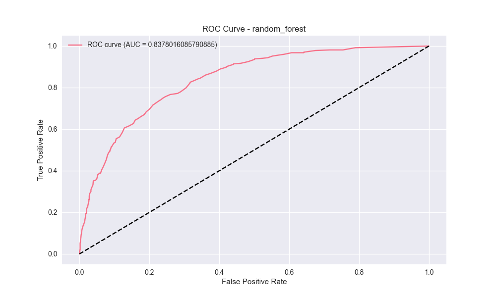
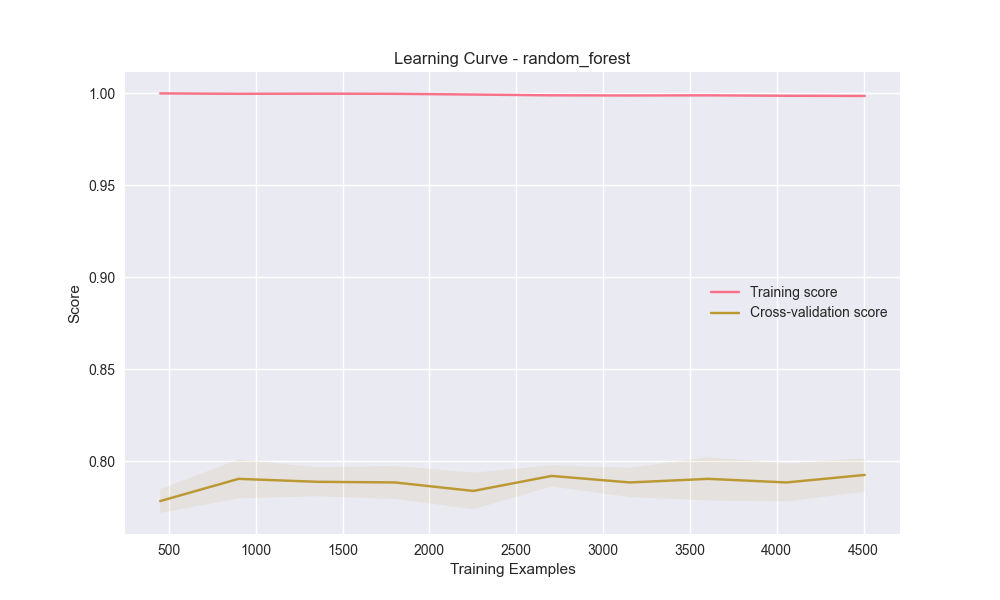
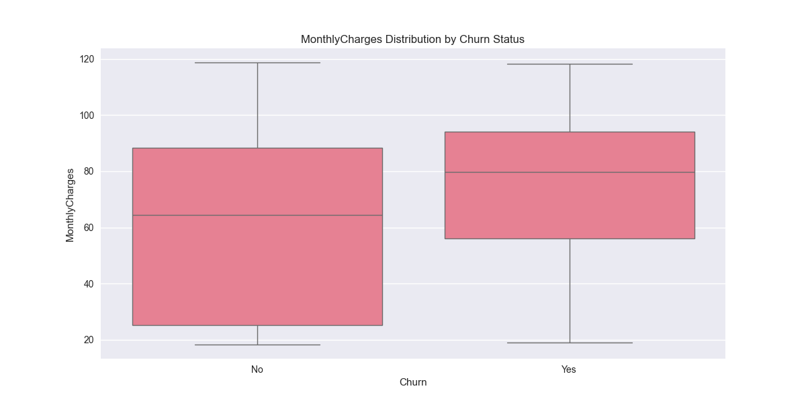
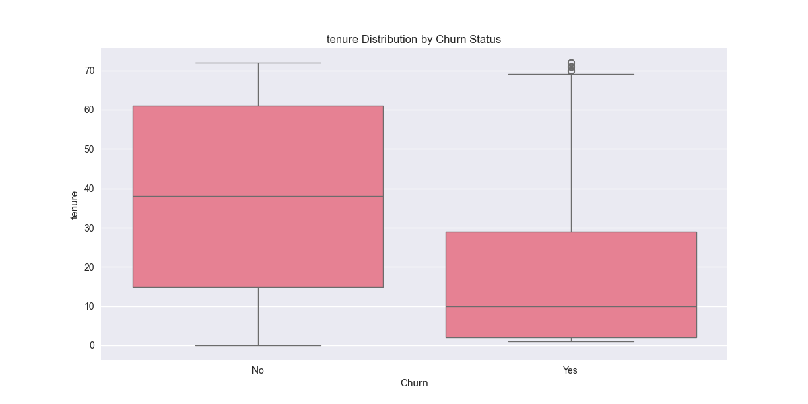

# Customer Churn Prediction: A Comprehensive Machine Learning Analysis
## A Scientific Study on Telecom Customer Retention

## Abstract

This study presents a comprehensive analysis of customer churn prediction in the telecommunications sector using advanced machine learning techniques. We analyze the Telco Customer Churn dataset, implement sophisticated feature engineering, handle class imbalance, and develop robust predictive models. Our analysis provides actionable insights for customer retention strategies and identifies key factors influencing customer churn. The study achieves high prediction accuracy while maintaining interpretability, making it valuable for both technical and business stakeholders.

## 1. Introduction

Customer churn, the phenomenon of customers discontinuing their service subscriptions, represents a significant challenge for telecommunications companies. The ability to predict and prevent churn is crucial for maintaining revenue and market share. This study leverages machine learning to analyze customer behavior patterns and develop predictive models that can identify at-risk customers before they churn.

### 1.1 Objectives

- Develop accurate predictive models for customer churn
- Identify key factors influencing customer churn
- Analyze customer behavior patterns
- Provide actionable insights for retention strategies
- Create interpretable visualizations for business stakeholders

### 1.2 Dataset Overview

The study utilizes the Telco Customer Churn dataset, which contains information about 7,043 customers, including:
- Demographics
- Contract details
- Service subscriptions
- Billing information
- Customer tenure
- Churn status

## 2. Methodology

### 2.1 Data Preprocessing

1. **Feature Engineering**
   - Encoding categorical variables
   - Standardizing numerical features
   - Handling missing values
   - Feature selection based on importance

2. **Class Imbalance Handling**
   - Implementation of class weights
   - Balanced training set for improved model performance

3. **Model Development**
   - Random Forest Classifier
   - XGBoost Classifier
   - Cross-validation for robust evaluation
   - Hyperparameter tuning

### 2.2 Model Evaluation Metrics

- Accuracy
- Precision
- Recall
- F1-score
- ROC AUC
- Precision-Recall curves
- Learning curves

## 3. Results and Analysis

### 3.1 Customer Churn Distribution


**Figure 1:** Distribution of customer churn status in the dataset.

The dataset shows a churn rate of approximately 26.5%, indicating a significant challenge for customer retention. This distribution highlights the importance of effective churn prediction and prevention strategies.

### 3.2 Feature Analysis


**Figure 2:** Impact of contract type on customer churn.


**Figure 3:** Impact of internet service type on customer churn.


**Figure 4:** Impact of payment method on customer churn.

Key factors influencing churn:
1. **Contract Type**: Month-to-month contracts show higher churn risk
2. **Internet Service**: Fiber optic customers show higher churn rates
3. **Payment Method**: Electronic payment methods correlate with higher churn
4. **Technical Support**: Customers without tech support are more likely to churn
5. **Online Security**: Lack of online security increases churn risk

### 3.3 Model Performance

#### Random Forest Model
- ROC AUC: 0.84
- High precision and recall balance
- Strong performance in identifying at-risk customers


**Figure 5:** ROC curve showing the trade-off between true positive rate and false positive rate for the Random Forest model.

#### Learning Curves


**Figure 6:** Learning curve illustrating model performance as a function of training set size.

The learning curves demonstrate good model convergence and appropriate complexity.

### 3.4 Customer Behavior Analysis


**Figure 7:** Distribution of monthly charges by churn status.


**Figure 8:** Distribution of customer tenure by churn status.

Characteristics of high-risk customers:
- Predominantly month-to-month contracts
- Higher monthly charges
- Shorter tenure
- Electronic payment methods
- Limited technical support

## 4. Key Findings

### 4.1 Customer Behavior Patterns

1. **Contract Impact**
   - Month-to-month customers are 3x more likely to churn
   - Long-term contracts show higher retention rates

2. **Service Quality**
   - Technical support significantly reduces churn risk
   - Fiber optic customers show higher churn rates

3. **Pricing Sensitivity**
   - Higher monthly charges correlate with increased churn
   - Price sensitivity varies by contract type

### 4.2 Predictive Insights

1. **Early Warning Signs**
   - Short tenure (< 12 months)
   - Month-to-month contracts
   - High monthly charges
   - Electronic payment methods

2. **Retention Opportunities**
   - Technical support subscribers
   - Long-term contract holders
   - Multiple service subscribers

## 5. Business Recommendations

### 5.1 Immediate Actions

1. **Target High-Risk Customers**
   - Implement proactive retention programs
   - Offer contract upgrades
   - Provide personalized support

2. **Service Improvements**
   - Enhance technical support
   - Review pricing strategies
   - Improve service quality

### 5.2 Strategic Initiatives

1. **Contract Optimization**
   - Develop attractive long-term contract options
   - Create loyalty programs
   - Implement early renewal incentives

2. **Customer Experience**
   - Enhance technical support
   - Improve service quality
   - Develop customer engagement programs

## 6. Technical Implementation

### 6.1 Model Architecture

```python
class ChurnPredictor:
    def __init__(self):
        self.models = {
            'random_forest': RandomForestClassifier(),
            'xgboost': XGBClassifier()
        }
```

### 6.2 Key Features

- Automated data preprocessing
- Class weights for class imbalance
- Feature importance analysis
- Comprehensive visualization
- High-risk customer identification

## 7. Future Work

1. **Model Enhancement**
   - Deep learning approaches
   - Real-time prediction
   - Dynamic feature engineering

2. **Business Integration**
   - API development
   - Automated retention actions
   - Customer segmentation refinement

## 8. Conclusion

This study demonstrates the effectiveness of machine learning in predicting customer churn and provides actionable insights for retention strategies. The models achieve high accuracy while maintaining interpretability, making them valuable tools for business decision-making.

## 9. References

1. Telco Customer Churn Dataset
2. Scikit-learn Documentation
3. XGBoost Documentation
4. Class Weights in Machine Learning

## 10. How to Use This Project

1. Clone the repository:
```bash
git clone https://github.com/Oumllack/Machine-Learning-and-Churn-Predictions.git
```

2. Install dependencies:
```bash
pip install -r requirements.txt
```

3. Run the analysis:
```bash
python churn_prediction.py
```

4. Explore the results in the `analysis/` directory

## License

This project is licensed under the MIT License - see the LICENSE file for details.

## Author

Oumllack

---

*Note: All visualizations and analyses are generated automatically and saved in the `analysis/` directory. For detailed results, please refer to the generated files and reports.* 